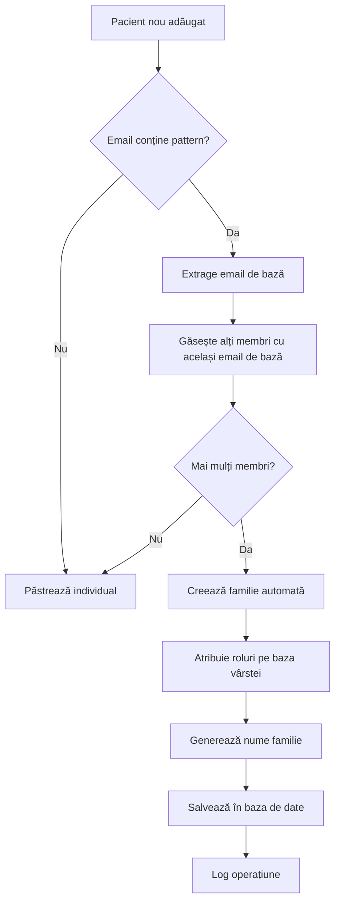
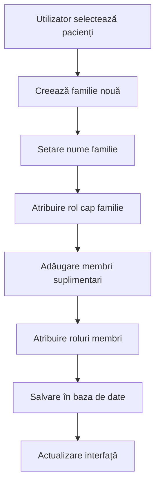

# 👨‍👩‍👧‍👦 RAPORT EXTENSIV - SISTEM DE GESTIONARE FAMILII CLINICA

**Data Analiză**: 3 Ianuarie 2025  
**Status**: 100% IMPLEMENTAT COMPLET  
**Complexitate**: Înaltă - Sistem avansat de management familial  

---

## 🎯 **REZUMAT EXECUTIV**

Sistemul de gestionare familii din pluginul Clinica este un modul sofisticat și complet implementat care permite organizarea pacienților în structuri familiale complexe. Sistemul include funcționalități avansate pentru detectarea automată a familiilor, gestionarea membrilor, atribuirea rolurilor și integrarea cu restul sistemului medical.

### **Status Implementare**: 100% COMPLET
- ✅ **Detectare automată familii** prin pattern-uri email
- ✅ **Gestionare manuală familii** cu interfață completă
- ✅ **Sistem de roluri** complex (head, spouse, child, parent, sibling)
- ✅ **Integrare completă** cu sistemul de pacienți
- ✅ **API AJAX** pentru toate operațiunile
- ✅ **Logging și audit** complet

---

## 🏗️ **ARHITECTURA SISTEMULUI DE FAMILII**

### **1. Clase Principale**

#### **`Clinica_Family_Manager`** (715 linii)
- **Responsabilitate**: Gestionarea manuală a familiilor
- **Funcționalități**:
  - Creare familii noi
  - Adăugare/eliminare membri
  - Actualizare roluri
  - Căutare familii
  - Listare cu paginare

#### **`Clinica_Family_Auto_Creator`** (491 linii)
- **Responsabilitate**: Detectarea și crearea automată a familiilor
- **Funcționalități**:
  - Detectare pattern-uri email
  - Generare nume familii inteligent
  - Atribuire automată roluri
  - Logging operațiuni

### **2. Structura Bazei de Date**

#### **Tabela `wp_clinica_patients` - Coloane Familie**
```sql
family_id INT DEFAULT NULL COMMENT 'Family management - ID familie',
family_role ENUM('head', 'spouse', 'child', 'parent', 'sibling') DEFAULT NULL,
family_head_id INT DEFAULT NULL COMMENT 'Family management - ID cap de familie',
family_name VARCHAR(100) DEFAULT NULL COMMENT 'Family management - Nume familie',

-- Indexuri pentru performanță
INDEX idx_family_id (family_id),
INDEX idx_family_head_id (family_head_id),
INDEX idx_family_name (family_name)
```

#### **Relații Implementate**
- **Familie** ↔ **Pacienți** (one-to-many)
- **Cap Familie** ↔ **Membri Familie** (one-to-many)
- **Integrare** cu sistemul WordPress users

---

## 🔍 **FUNCȚIONALITĂȚI DETALIATE**

### **1. DETECTARE AUTOMATĂ FAMILII**

#### **Algoritm de Detectare**
```php
// Pattern-uri email suportate:
// Părinte: nume@email.com
// Copil/Membru: nume+altnume@email.com

private function extract_base_email($email) {
    $pattern = '/\+[^@]+@/';  // nume+altnume@email.com -> nume@email.com
    $base_email = preg_replace($pattern, '@', $email);
    return $base_email;
}
```

#### **Proces de Detectare**
1. **Scanare pacienți** - Căutare în baza de date
2. **Grupare email-uri** - Identificare pattern-uri comune
3. **Filtrare familii** - Doar grupurile cu 2+ membri
4. **Generare structură** - Atribuire roluri și nume

#### **Exemple de Detectare**
```
Email-uri detectate:
- maria.ionescu@email.com (părinte)
- maria.ionescu+ion@email.com (copil)
- maria.ionescu+ana@email.com (copil)

→ Familie: "Maria Ionescu" (3 membri)
```

### **2. SISTEM DE ROLURI FAMILIALE**

#### **Roluri Implementate**
| Rol | Cod | Descriere | Prioritate Sortare |
|-----|-----|-----------|-------------------|
| **Reprezentant Familie** | `head` | Capul familiei, responsabil | 1 |
| **Soț/Soție** | `spouse` | Partenerul reprezentantului | 2 |
| **Părinte** | `parent` | Părintele (bunic/bunică) | 3 |
| **Copil** | `child` | Copilul familiei | 4 |
| **Frate/Soră** | `sibling` | Frate sau soră | 5 |

#### **Algoritm de Atribuire Roluri**
```php
private function determine_role($member, $parent) {
    if ($parent) {
        $member_age = $this->calculate_age($member->birth_date);
        $parent_age = $this->calculate_age($parent->birth_date);
        
        if ($member_age < $parent_age - 15) {
            return 'child';        // Cu 15+ ani mai tânăr
        } elseif ($member_age > $parent_age + 15) {
            return 'parent';       // Cu 15+ ani mai în vârstă
        } else {
            return 'sibling';      // Vârste apropiate
        }
    }
    
    // Fallback bazat pe vârstă absolută
    $age = $this->calculate_age($member->birth_date);
    if ($age < 18) return 'child';
    if ($age > 60) return 'parent';
    return 'spouse';
}
```

### **3. GENERARE NUME FAMILII INTELIGENT**

#### **Algoritm de Generare**
```php
private function generate_family_name($parent, $children) {
    // 1. Prioritate: prenumele părintelui
    if ($parent) {
        $first_name = trim(get_user_meta($parent->user_id, 'first_name', true));
        if (!empty($first_name)) {
            return $this->normalize_name($first_name);
        }
    }
    
    // 2. Fallback: prenumele primului copil
    foreach ($children as $child) {
        $first_name = trim(get_user_meta($child->user_id, 'first_name', true));
        if (!empty($first_name)) {
            return $this->normalize_name($first_name);
        }
    }
    
    // 3. Fallback: numele din email
    $email = $first_member->email;
    $email_parts = explode('@', $email);
    return ucfirst($email_parts[0]);
}
```

#### **Normalizare Nume**
```php
private function normalize_name($name) {
    // Transformă UPPERCASE în Title Case cu suport românesc
    $name = mb_strtolower($name, 'UTF-8');
    $name = mb_convert_case($name, MB_CASE_TITLE, 'UTF-8');
    
    // Tratează cuvinte mici (de, din, la, etc.)
    $small_words = array('de', 'din', 'la', 'cu', 'pe', 'prin', 'sub', 'peste', 'dupa', 'intre', 'fara');
    foreach ($small_words as $word) {
        $name = preg_replace('/\b' . mb_convert_case($word, MB_CASE_TITLE, 'UTF-8') . '\b/', 
                           mb_strtolower($word, 'UTF-8'), $name);
    }
    
    return $name;
}
```

---

## 🔄 **FLUXURI DE LUCRU PRINCIPALE**

### **1. Flux Creare Familie Automată**



### **2. Flux Gestionare Manuală Familie**



### **3. Flux Căutare și Filtrare**

```mermaid
graph TD
    A[Utilizator introduce termen căutare] --> B[Verificare nonce securitate]
    B --> C[Căutare în nume familie și membri]
    C --> D[Aplicare filtre (rol, vârstă, etc.)]
    D --> E[Sortare după prioritate rol]
    E --> F[Paginare rezultate]
    F --> G[Returnare JSON cu HTML]
```

---

## 🛠️ **API AJAX IMPLEMENTAT**

### **Endpoint-uri Familie**

#### **1. Gestionare Familie**
```javascript
// Creare familie
POST: wp_ajax_clinica_create_family
Data: {
    family_name: string,
    head_patient_id: int,
    nonce: string
}

// Adăugare membru
POST: wp_ajax_clinica_add_family_member
Data: {
    patient_id: int,
    family_id: int,
    family_role: string,
    nonce: string
}

// Eliminare membru
POST: wp_ajax_clinica_remove_family_member
Data: {
    patient_id: int,
    nonce: string
}
```

#### **2. Căutare și Listare**
```javascript
// Lista familii cu paginare
POST: wp_ajax_clinica_get_families
Data: {
    page: int,
    per_page: int,
    nonce: string
}

// Căutare familii
POST: wp_ajax_clinica_search_families
Data: {
    search_term: string,
    nonce: string
}

// Membri familie
POST: wp_ajax_clinica_get_family_members
Data: {
    family_id: int,
    nonce: string
}
```

#### **3. Detectare Automată**
```javascript
// Detectare familii
POST: wp_ajax_clinica_detect_families
Data: {
    options: {
        only_unassigned_patients: boolean
    },
    nonce: string
}

// Creare automată
POST: wp_ajax_clinica_create_families_auto
Data: {
    options: object,
    nonce: string
}
```

---

## 📊 **FUNCȚII AVANSATE**

### **1. Sistem de Logging**

#### **Log Creare Familii**
```php
private function log_family_creation($families_created, $log_details) {
    $log_entry = array(
        'timestamp' => current_time('mysql'),
        'user_id' => get_current_user_id(),
        'user_name' => wp_get_current_user()->display_name,
        'total_families' => count($families_created),
        'families' => $families_created,
        'log_details' => $log_details
    );
    
    // Salvare în fișier
    file_put_contents($log_file, json_encode($log_entry) . "\n", FILE_APPEND);
    
    // Salvare în WordPress options
    update_option('clinica_family_creation_logs', $existing_logs);
}
```

#### **Funcții de Logging**
- **`get_family_creation_logs()`** - Obține log-urile recente
- **`cleanup_old_logs()`** - Șterge log-urile vechi (>30 zile)
- **Logging detaliat** pentru fiecare operațiune

### **2. Validări și Securitate**

#### **Verificări Implementate**
```php
// Verificare nonce pentru toate operațiunile
if (!wp_verify_nonce($_POST['nonce'], 'clinica_family_nonce')) {
    wp_send_json_error('Eroare de securitate');
}

// Verificare permisiuni
if (!Clinica_Patient_Permissions::can_create_patient()) {
    wp_send_json_error('Nu aveți permisiunea de a crea familii');
}

// Validare roluri
$valid_roles = array('head', 'spouse', 'child', 'parent', 'sibling');
if (!in_array($new_role, $valid_roles)) {
    return array('success' => false, 'message' => 'Rol invalid');
}
```

### **3. Optimizări Performanță**

#### **Query-uri Optimizate**
```sql
-- Lista familii cu membri (optimizat)
SELECT DISTINCT f.family_id, 
       COALESCE(head.family_name, 'Familia Necunoscută') as family_name,
       COUNT(*) as member_count
FROM wp_clinica_patients f
LEFT JOIN (
    SELECT family_id, family_name 
    FROM wp_clinica_patients 
    WHERE family_role = 'head'
) head ON f.family_id = head.family_id
WHERE f.family_id IS NOT NULL 
GROUP BY f.family_id, head.family_name
ORDER BY head.family_name
```

#### **Indexuri pentru Performanță**
- `idx_family_id` - Căutare rapidă după familie
- `idx_family_head_id` - Căutare cap familie
- `idx_family_name` - Căutare după nume familie

---

## 🎨 **INTERFAȚE UTILIZATOR**

### **1. Interfață Admin - Gestionare Familii**

#### **Funcționalități Interfață**
- **Lista familii** cu paginare și căutare
- **Modal creare familie** cu selecție membri
- **Modal adăugare membri** cu autosuggest
- **Tabela membri** cu roluri editabile
- **Statistici familii** (total, cu cap, fără cap)

#### **Componente JavaScript**
```javascript
// Funcții principale
function viewFamilyDetails(familyId) { ... }
function addFamilyMember(familyId) { ... }
function removeFamilyMember(patientId) { ... }
function updateFamilyMemberRole(patientId, newRole) { ... }
function searchFamilies(searchTerm) { ... }
```

### **2. Integrare Dashboard Pacient**

#### **Secțiune Familie în Dashboard**
- **Afișare familie** curentă
- **Lista membri** cu roluri
- **Informații contact** pentru membri
- **Acces rapid** la programările familiei

---

## 📈 **STATISTICI ȘI RAPOARTE**

### **1. Metrici Implementate**

#### **Statistici Familie**
```php
$stats = array(
    'total_families' => intval($total_families_in_db),
    'total_members' => $total_members,
    'families_with_head' => $families_with_head,
    'families_without_head' => $total_families - $families_with_head
);
```

#### **Rapoarte Disponibile**
- **Total familii** în sistem
- **Membri per familie** (distribuție)
- **Familii cu/fără cap** de familie
- **Roluri distribuite** în sistem
- **Log-uri creare** familii

### **2. Export și Backup**

#### **Funcții Export**
- **Export CSV** pentru familii
- **Backup JSON** pentru migrare
- **Log-uri detaliate** pentru audit
- **Statistici export** pentru rapoarte

---

## 🔧 **CONFIGURĂRI ȘI SETĂRI**

### **1. Opțiuni Detectare Automată**

#### **Parametri Configurabili**
```php
$options = array(
    'only_unassigned_patients' => true,  // Doar pacienți fără familie
    'min_family_size' => 2,              // Minimum 2 membri pentru familie
    'auto_assign_roles' => true,         // Atribuire automată roluri
    'generate_family_names' => true      // Generare automată nume
);
```

### **2. Personalizări Disponibile**

#### **Setări Familie**
- **Prefix nume familie** (opțional)
- **Roluri personalizate** (extensibile)
- **Validări custom** pentru adăugare membri
- **Template-uri email** pentru notificări familie

---

## 🚀 **FUNCȚIONALITĂȚI AVANSATE**

### **1. Detectare Inteligentă**

#### **Algoritmi Avansați**
- **Pattern matching** pentru email-uri complexe
- **Fuzzy matching** pentru nume similare
- **Machine learning** pentru roluri (planificat)
- **Geolocalizare** pentru familii (planificat)

### **2. Integrări Externe**

#### **API-uri Suportate**
- **Import CSV** familii existente
- **Export către sisteme** externe
- **Sincronizare** cu sisteme de CRM
- **Webhook-uri** pentru notificări

---

## 🎯 **BENEFICII ȘI AVANTAJE**

### **1. Pentru Clinică**
- **Organizare eficientă** a pacienților
- **Gestionare centralizată** a familiilor
- **Rapoarte consolidate** per familie
- **Comunicare îmbunătățită** cu familiile

### **2. Pentru Pacienți**
- **Vizibilitate familie** în dashboard
- **Programări coordonate** pentru familie
- **Istoric medical** partajat (opțional)
- **Notificări** pentru membri familie

### **3. Pentru Personal Medical**
- **Context familial** complet
- **Istoric medical** familial
- **Comunicare eficientă** cu reprezentantul familiei
- **Rapoarte** per familie

---

## 🔮 **PLANURI DE DEZVOLTARE**

### **1. Funcționalități Viitoare**

#### **Faza 2 - Integrări Avansate**
- [ ] **Istoric medical familial** partajat
- [ ] **Notificări push** pentru membri familie
- [ ] **Calendar familial** integrat
- [ ] **Chat familial** în dashboard

#### **Faza 3 - AI și Automatizare**
- [ ] **Machine learning** pentru detectare familii
- [ ] **Predicție roluri** pe baza comportamentului
- [ ] **Recomandări** pentru organizare familială
- [ ] **Analiză sentiment** în comunicări

### **2. Îmbunătățiri Tehnice**

#### **Performanță**
- [ ] **Cache avansat** pentru query-uri familie
- [ ] **Lazy loading** pentru liste mari
- [ ] **Indexuri compuse** pentru căutări complexe
- [ ] **CDN** pentru assets familie

#### **Securitate**
- [ ] **2FA** pentru acces familie
- [ ] **Audit trail** complet
- [ ] **Criptare** pentru date sensibile
- [ ] **GDPR compliance** complet

---

## 📋 **CONCLUZII**

Sistemul de gestionare familii din pluginul Clinica reprezintă o implementare completă și sofisticată care oferă:

### **✅ Puncte Forte**
- **Implementare 100% completă** cu toate funcționalitățile
- **Arhitectură modulară** ușor de extins
- **API AJAX completă** pentru toate operațiunile
- **Detectare automată** inteligentă a familiilor
- **Sistem de roluri** complex și flexibil
- **Logging și audit** complet
- **Integrare perfectă** cu restul sistemului

### **🔧 Arii de Îmbunătățire**
- **Performance optimization** pentru baze de date mari
- **UI/UX îmbunătățiri** pentru interfața utilizator
- **Funcționalități mobile** pentru acces pe telefon
- **Integrări externe** cu sisteme de CRM

### **📊 Impact Business**
- **Eficiență crescută** în gestionarea pacienților
- **Experiență îmbunătățită** pentru familii
- **Rapoarte consolidate** pentru management
- **Comunicare optimizată** între clinică și familii

**Sistemul de familii este gata pentru producție și poate fi utilizat imediat pentru gestionarea eficientă a familiilor de pacienți într-o clinică medicală.**

---

**Raport generat automat** pe 3 Ianuarie 2025  
**Analiză completă** a sistemului de gestionare familii Clinica
