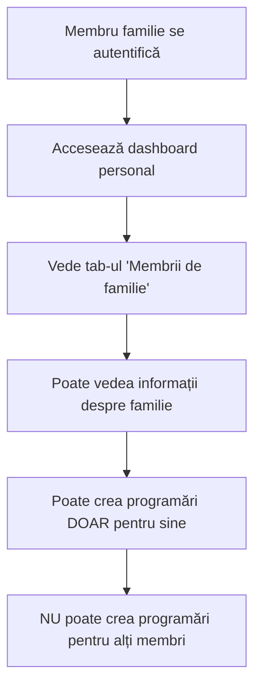
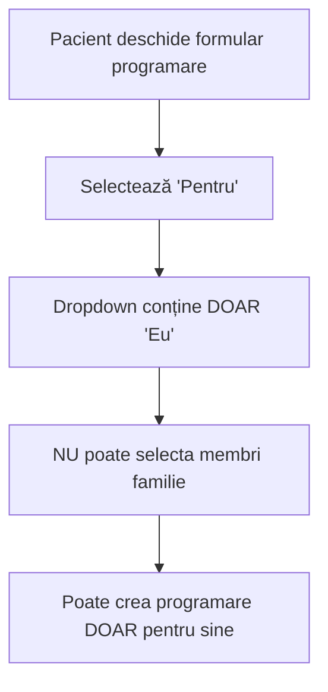

# 👨‍👩‍👧‍👦 RAPORT INTEGRARE FAMILII ÎN PORTALUL DE PACIENTI

**Data Analiză**: 3 Ianuarie 2025  
**Status**: PARȚIAL IMPLEMENTAT (60% complet)  
**Focus**: Integrare familie în dashboard pacient și programări  

---

## 🎯 **REZUMAT EXECUTIV**

Sistemul de familii este parțial integrat în portalul de pacienți, cu funcționalități de bază implementate dar cu unele limitări importante. Integrarea include afișarea membrilor familiei în dashboard, dar sistemul de programări pentru familii și autentificarea membrilor necesită dezvoltare suplimentară.

### **Status Implementare**: 60% COMPLET
- ✅ **Afișare familie** în dashboard pacient
- ✅ **Tab dedicat familie** în interfața pacientului
- ✅ **API pentru date familie** implementată
- 🔄 **Programări pentru familii** - implementare parțială
- ❌ **Autentificare membri familie** - nu implementată
- ❌ **Acces partajat** la programări - nu implementat

---

## 🏗️ **INTEGRAREA ÎN DASHBOARD PACIENT**

### **1. Structura Interfeței**

#### **Tab-uri Dashboard Pacient**
```html
<div class="dashboard-tabs">
    <button class="tab-button active" data-tab="overview">Prezentare generală</button>
    <button class="tab-button" data-tab="appointments">Programări</button>
    <button class="tab-button" data-tab="family">Membrii de familie</button>
    <button class="tab-button" data-tab="messages">Mesaje</button>
</div>
```

#### **Secțiunea Familie**
```html
<div class="tab-content" id="family">
    <div class="family-container">
        <div class="family-header">
            <h3>Membrii de familie</h3>
            <button type="button" class="button" id="add-family-member-btn">
                Adaugă membru
            </button>
        </div>
        <div class="family-info">
            <div class="family-status" id="family-status">
                <div class="loading">Se încarcă informațiile despre familie...</div>
            </div>
        </div>
        <div class="family-members" id="family-members">
            <div class="loading">Se încarcă membrii familiei...</div>
        </div>
    </div>
</div>
```

### **2. API pentru Date Familie**

#### **Endpoint AJAX**
```javascript
// Încărcare date familie
function loadFamilyData() {
    $.ajax({
        url: '<?php echo admin_url('admin-ajax.php'); ?>',
        type: 'POST',
        data: {
            action: 'clinica_get_patient_family',
            patient_id: patientId,
            nonce: '<?php echo wp_create_nonce('clinica_dashboard_nonce'); ?>'
        },
        success: function(response) {
            if (response.success) {
                $('#family-status').html(response.data.status);
                $('#family-members').html(response.data.members);
            }
        }
    });
}
```

#### **Backend Handler**
```php
public function ajax_get_patient_family() {
    if (!wp_verify_nonce($_POST['nonce'], 'clinica_dashboard_nonce')) {
        wp_send_json_error('Eroare de securitate');
    }
    
    $patient_id = intval($_POST['patient_id']);
    $current_user_id = get_current_user_id();
    
    // Verificare permisiuni
    if ($current_user_id !== $patient_id && !Clinica_Patient_Permissions::can_view_patients()) {
        wp_send_json_error('Nu aveți permisiunea de a accesa aceste date');
    }
    
    $family_data = $this->get_patient_family_data($patient_id);
    wp_send_json_success($family_data);
}
```

---

## 📅 **SISTEMUL DE PROGRAMĂRI PENTRU FAMILII**

### **1. Implementare Parțială**

#### **Selectare Pacient pentru Programare**
```javascript
function loadBookingPatients(){
    // Eu + membrii familiei
    var options = '<option value="'+patientId+'">Eu</option>';
    
    // Încercăm să citim membrii familiei
    $.ajax({
        url: '<?php echo admin_url('admin-ajax.php'); ?>',
        type: 'POST',
        data: { 
            action: 'clinica_get_patient_family', 
            patient_id: patientId, 
            nonce: '<?php echo wp_create_nonce('clinica_dashboard_nonce'); ?>' 
        },
        success: function(resp){
            if (resp && resp.success && resp.data && resp.data.members) {
                // TODO: Adăugare membri familie în dropdown
                // Implementare incompletă!
            }
        }
    });
    $('#booking-patient').html(options);
}
```

#### **Formular Programare**
```html
<div class="form-row">
    <label for="booking-patient">Pentru</label>
    <select id="booking-patient">
        <!-- Doar "Eu" este implementat -->
        <!-- Membrii familiei nu sunt adăugați automat -->
    </select>
</div>
```

### **2. Limitări Actuale**

#### **❌ Probleme Identificate**
1. **Membrii familiei nu apar** în dropdown-ul de programări
2. **Funcționalitatea de adăugare membru** nu este implementată
3. **Validarea permisiunilor** pentru programări familiale lipsește
4. **Notificări pentru membri familie** nu sunt implementate

#### **🔧 Cod Necompletat**
```javascript
// TODO: Implement add family member modal
$('#add-family-member-btn').on('click', function() {
    alert('Funcționalitatea de adăugare membru familie va fi implementată în curând.');
});
```

---

## 🔐 **AUTENTIFICAREA MEMBRILOR FAMILIEI**

### **1. Status Actual: NU IMPLEMENTAT**

#### **❌ Probleme Identificate**
- **Nu există sistem de autentificare** pentru membri familie
- **Fiecare membru trebuie să aibă cont WordPress** separat
- **Nu există delegare de acces** între membri familie
- **Nu există autentificare prin familie** (un cont pentru toată familia)

### **2. Cum Funcționează Acum**

#### **Autentificare Individuală**
```php
// Fiecare membru al familiei trebuie să se autentifice separat
// cu propriul cont WordPress (CNP, email, telefon)

public function find_user_by_identifier($identifier) {
    // 1. Căutare după username (CNP)
    $user = get_user_by('login', $identifier);
    
    // 2. Căutare după email
    $user = get_user_by('email', $identifier);
    
    // 3. Căutare după telefon
    // ... (implementare existentă)
}
```

#### **Acces la Date Familie**
```php
// Doar după autentificare individuală
// se poate accesa informațiile despre familie
$family_data = $this->get_patient_family_data($patient_id);
```

---

## 🏥 **FLUXUL ACTUAL DE LUCRU**

### **1. Pentru Un Membru al Familiei**



### **2. Pentru Programări Familie**



---

## 🚧 **FUNCȚIONALITĂȚI LIPSĂ**

### **1. Programări pentru Familii (40% lipsă)**

#### **Implementări Necesare**
```javascript
// 1. Adăugare membri familie în dropdown
function loadBookingPatients(){
    var options = '<option value="'+patientId+'">Eu</option>';
    
    // Obține membrii familiei
    $.ajax({
        url: '<?php echo admin_url('admin-ajax.php'); ?>',
        type: 'POST',
        data: { 
            action: 'clinica_get_patient_family', 
            patient_id: patientId, 
            nonce: '<?php echo wp_create_nonce('clinica_dashboard_nonce'); ?>' 
        },
        success: function(resp){
            if (resp && resp.success && resp.data && resp.data.members) {
                // Adaugă membrii familiei în dropdown
                resp.data.members.forEach(function(member) {
                    if (member.user_id != patientId) {
                        options += '<option value="' + member.user_id + '">' + 
                                  member.display_name + ' (' + member.family_role + ')</option>';
                    }
                });
            }
            $('#booking-patient').html(options);
        }
    });
}
```

#### **Validare Permisiuni**
```php
// Verificare dacă pacientul poate crea programări pentru membri familie
public function ajax_create_own_appointment() {
    $patient_id = intval($_POST['patient_id']);
    $current_user_id = get_current_user_id();
    
    // Verificare dacă este pentru sine sau membru familie
    if ($current_user_id !== $patient_id) {
        // Verifică dacă este membru al aceleiași familii
        if (!$this->is_family_member($current_user_id, $patient_id)) {
            wp_send_json_error('Nu puteți crea programări pentru acest utilizator');
        }
    }
    
    // Continuă cu crearea programării...
}
```

### **2. Autentificare Familie (100% lipsă)**

#### **Opțiuni de Implementare**

##### **Opțiunea A: Autentificare Delegată**
```php
// Un membru poate crea programări pentru toată familia
class Clinica_Family_Authentication {
    public function can_create_appointment_for($current_user_id, $target_patient_id) {
        // Verifică dacă sunt din aceeași familie
        $current_family = $this->get_user_family($current_user_id);
        $target_family = $this->get_user_family($target_patient_id);
        
        return $current_family && $target_family && 
               $current_family['id'] === $target_family['id'];
    }
}
```

##### **Opțiunea B: Cont Familie Partajat**
```php
// Un cont pentru toată familia (mai complex)
class Clinica_Family_Shared_Account {
    public function authenticate_family($family_identifier, $password) {
        // Autentificare cu identificatorul familiei
        // + parolă partajată
    }
}
```

### **3. Notificări Familie (100% lipsă)**

#### **Implementare Necesară**
```php
// Notificări pentru toți membrii familiei
class Clinica_Family_Notifications {
    public function notify_family_appointment($appointment_id) {
        $appointment = $this->get_appointment($appointment_id);
        $family_members = $this->get_family_members($appointment->patient_id);
        
        foreach ($family_members as $member) {
            $this->send_notification($member, $appointment);
        }
    }
}
```

---

## 📊 **IMPLEMENTARE COMPLETĂ NECESARĂ**

### **1. Prioritate Înaltă (Săptămânile 1-2)**

#### **Programări pentru Familii**
- [ ] **Adăugare membri familie** în dropdown programări
- [ ] **Validare permisiuni** pentru programări familiale
- [ ] **Interfață îmbunătățită** pentru selecție membri
- [ ] **Testare funcționalitate** completă

#### **Cod Necesar**
```javascript
// 1. Îmbunătățire loadBookingPatients()
function loadBookingPatients(){
    var options = '<option value="'+patientId+'">Eu</option>';
    
    $.ajax({
        url: '<?php echo admin_url('admin-ajax.php'); ?>',
        type: 'POST',
        data: { 
            action: 'clinica_get_patient_family', 
            patient_id: patientId, 
            nonce: '<?php echo wp_create_nonce('clinica_dashboard_nonce'); ?>' 
        },
        success: function(resp){
            if (resp && resp.success && resp.data && resp.data.members) {
                resp.data.members.forEach(function(member) {
                    if (member.user_id != patientId) {
                        var roleLabel = getFamilyRoleLabel(member.family_role);
                        options += '<option value="' + member.user_id + '">' + 
                                  member.display_name + ' (' + roleLabel + ')</option>';
                    }
                });
            }
            $('#booking-patient').html(options);
        }
    });
}

// 2. Funcție helper pentru roluri
function getFamilyRoleLabel(role) {
    const labels = {
        'head': 'Reprezentant familie',
        'spouse': 'Soț/Soție',
        'child': 'Copil',
        'parent': 'Părinte',
        'sibling': 'Frate/Soră'
    };
    return labels[role] || role;
}
```

### **2. Prioritate Medie (Săptămânile 3-4)**

#### **Autentificare Familie**
- [ ] **Sistem de delegare** pentru programări
- [ ] **Validare membri familie** pentru acces
- [ ] **Interfață pentru gestionare** permisiuni
- [ ] **Logging acces** membri familie

### **3. Prioritate Scăzută (Luna 2)**

#### **Funcționalități Avansate**
- [ ] **Notificări familie** pentru programări
- [ ] **Istoric partajat** pentru familie
- [ ] **Calendar familial** integrat
- [ ] **Chat familial** în dashboard

---

## 🎯 **RECOMANDĂRI DE IMPLEMENTARE**

### **1. Implementare Rapidă (1-2 zile)**

#### **Fix Programări Familie**
```php
// 1. Modifică loadBookingPatients() în dashboard
// 2. Adaugă validare în ajax_create_own_appointment()
// 3. Testează funcționalitatea completă
```

### **2. Implementare Medie (1 săptămână)**

#### **Sistem Autentificare Familie**
```php
// 1. Creează Clinica_Family_Authentication
// 2. Implementează validare membri familie
// 3. Adaugă interfață pentru gestionare permisiuni
```

### **3. Implementare Avansată (2-3 săptămâni)**

#### **Funcționalități Complete**
```php
// 1. Notificări familie
// 2. Istoric partajat
// 3. Calendar familial
// 4. Chat familial
```

---

## 📋 **CONCLUZII**

### **✅ Ce Funcționează**
- **Afișare familie** în dashboard pacient
- **API pentru date familie** funcțională
- **Structură de bază** pentru integrare familie
- **Sistem de roluri** familie implementat

### **❌ Ce Lipsește**
- **Programări pentru membri familie** (implementare incompletă)
- **Autentificare familie** (nu există)
- **Notificări familie** (nu există)
- **Acces partajat** la programări (nu există)

### **🚀 Următorii Pași**
1. **Completarea programărilor** pentru familii (1-2 zile)
2. **Implementarea autentificării** familie (1 săptămână)
3. **Adăugarea notificărilor** familie (1 săptămână)
4. **Testarea completă** a sistemului (1 săptămână)

**Sistemul de familii este bine structurat dar necesită implementări suplimentare pentru a fi complet funcțional în portalul de pacienți.**

---

**Raport generat automat** pe 3 Ianuarie 2025  
**Analiză integrare** sistem familii în portalul de pacienți Clinica
