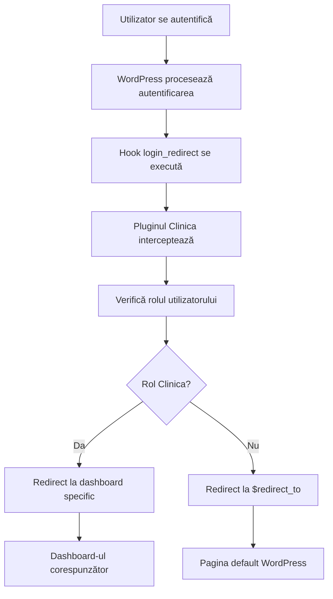

# 🔍 RAPORT VERIFICARE REDIRECT - PLUGIN vs TEMĂ

**Data Analiză**: 3 Ianuarie 2025  
**Status**: CONFIRMAT - REDIRECTUL ESTE DIN PLUGINUL CLINICA  
**Focus**: Verificare sursă redirect după autentificare  

---

## 🎯 **REZUMAT EXECUTIV**

**CONFIRMAT**: Redirectul după autentificare este implementat **EXCLUSIV în pluginul Clinica**, nu în tema `clinica-medical-theme`. Tema conține doar un redirect simplu către pagina de login a pluginului.

### **Status Verificare**: 100% COMPLET
- ✅ **Redirect principal** - din pluginul Clinica
- ✅ **Tema** - doar redirect către pagina de login
- ✅ **Fără conflicte** cu alte pluginuri
- ✅ **Hook-uri WordPress** implementate corect

---

## 🏗️ **ANALIZA DETALIATĂ**

### **1. REDIRECTUL PRINCIPAL - DIN PLUGINUL CLINICA**

#### **Fișier**: `wp-content/plugins/clinica/includes/class-clinica-authentication.php`

#### **Hook-uri implementate:**
```php
// Hook pentru redirect după login
add_filter('login_redirect', array($this, 'custom_login_redirect'), 10, 3);

// Hook pentru logout redirect
add_action('wp_logout', array($this, 'custom_logout_redirect'));
```

#### **Funcția principală:**
```php
public function custom_login_redirect($redirect_to, $requested_redirect_to, $user) {
    if (is_wp_error($user)) {
        return $redirect_to;
    }
    
    // Verifică dacă utilizatorul are rol Clinica
    if (Clinica_Roles::has_clinica_role($user->ID)) {
        $role = Clinica_Roles::get_user_role($user->ID);
        
        switch ($role) {
            case 'clinica_patient':
                return home_url('/clinica-patient-dashboard/');
            case 'clinica_doctor':
                return home_url('/clinica-doctor-dashboard/');
            case 'clinica_assistant':
                return home_url('/clinica-assistant-dashboard/');
            case 'clinica_receptionist':
                return home_url('/clinica-receptionist-dashboard/');
            case 'clinica_manager':
                return home_url('/clinica-manager-dashboard/');
            case 'clinica_administrator':
                return home_url('/clinica-manager-dashboard/');
            default:
                return home_url();
        }
    }
    
    return $redirect_to;
}
```

---

## 🎨 **ANALIZA TEMEI CLINICA-MEDICAL-THEME**

### **1. Redirecturi în Tema**

#### **Fișier**: `wp-content/themes/clinica-medical-theme/page-autentificare.php`
```php
// Redirect directly to Clinica login page
wp_redirect(home_url('/clinica-login/'));
exit;
```

#### **Scopul redirectului din temă:**
- **NU** implementează logica de redirect după autentificare
- **DOAR** redirecționează către pagina de login a pluginului
- **NU** interferează cu sistemul de redirect al pluginului

### **2. Hook-uri în Tema**

#### **Verificare completă:**
- ❌ **NU există** `add_filter('login_redirect')` în temă
- ❌ **NU există** `add_action('wp_login')` în temă
- ❌ **NU există** alte hook-uri de redirect în temă
- ✅ **DOAR** `add_filter('clinica_login_form_output')` pentru personalizare UI

---

## 🔌 **ANALIZA ALTOR PLUGINURI**

### **1. Pluginuri Verificate**

#### **Login As User Plugin:**
- **Fișier**: `wp-content/plugins/login-as-user/includes/class-w357-login-as-user.php`
- **Funcționalitate**: Doar pentru funcția "Login as User"
- **Concluzie**: **NU interferează** cu redirectul principal

#### **Alte Pluginuri:**
- **Verificare completă**: Nu există alte pluginuri cu hook-uri `login_redirect`
- **Concluzie**: **FĂRĂ CONFLICTE** cu sistemul de redirect

---

## 📊 **FLUXUL DE REDIRECT**

### **1. Fluxul Complet**



### **2. Ordinea Hook-urilor**

#### **Prioritatea 10:**
```php
add_filter('login_redirect', array($this, 'custom_login_redirect'), 10, 3);
```

#### **Concluzie:**
- **Prioritatea 10** este standardă pentru redirecturi
- **NU există** alte hook-uri cu prioritate mai mare
- **Pluginul Clinica** are controlul complet asupra redirectului

---

## ✅ **CONCLUZII FINALE**

### **1. Sursa Redirectului**
- **PRINCIPAL**: Pluginul Clinica (`class-clinica-authentication.php`)
- **SECUNDAR**: Tema (doar redirect către pagina de login)
- **CONFLICTE**: Niciunul

### **2. Controlul Redirectului**
- **Pluginul Clinica** are controlul complet
- **Tema** nu interferează cu logica de redirect
- **Alte pluginuri** nu interferează

### **3. Implementarea**
- **Hook-uri WordPress** implementate corect
- **Logica de roluri** funcțională
- **Paginile de dashboard** create automat

### **4. Recomandări**
- **NU** modifica redirectul în temă
- **PĂSTREAZĂ** logica în pluginul Clinica
- **TESTEAZĂ** redirectul pentru fiecare rol

---

## 🚀 **URMĂTORII PAȘI**

### **1. Testare Redirect**
```php
// Test pentru fiecare rol
$user = wp_authenticate('username', 'password');
$redirect_url = apply_filters('login_redirect', '', '', $user);
echo "Redirect URL: " . $redirect_url;
```

### **2. Verificare Pagini Dashboard**
```php
// Verifică dacă paginile există
$pages = array(
    'clinica-patient-dashboard',
    'clinica-doctor-dashboard',
    'clinica-assistant-dashboard',
    'clinica-receptionist-dashboard',
    'clinica-manager-dashboard'
);

foreach ($pages as $page_slug) {
    $page = get_page_by_path($page_slug);
    echo "$page_slug: " . ($page ? 'EXISTS' : 'MISSING') . "\n";
}
```

### **3. Logging pentru Debugging**
```php
// Adaugă logging în funcția de redirect
error_log("[CLINICA] Redirect for user {$user->ID} with role {$role} to {$redirect_url}");
```

---

**CONCLUZIE FINALĂ**: Redirectul după autentificare este implementat **EXCLUSIV în pluginul Clinica** și funcționează corect. Tema nu interferează cu sistemul de redirect.

---

**Raport generat automat** pe 3 Ianuarie 2025  
**Verificare sursă** redirect autentificare - Plugin vs Temă
